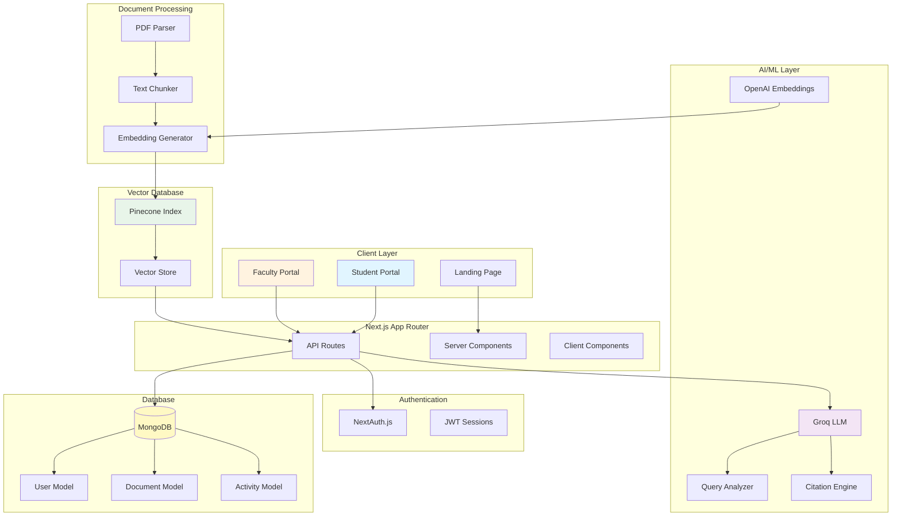
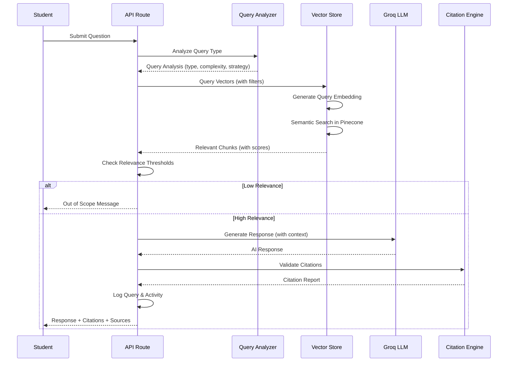
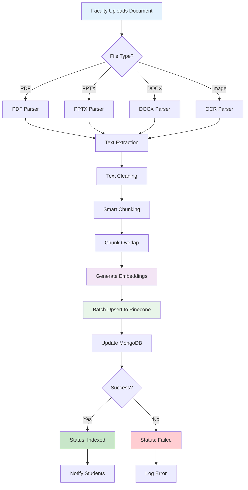
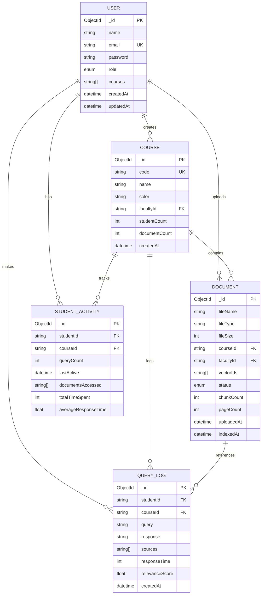
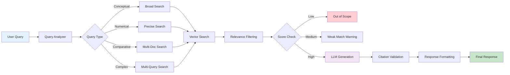

# RAG Tutor 🎓

> Your AI Tutor That Teaches, Not Solves

An intelligent educational platform that uses Retrieval-Augmented Generation (RAG) to provide context-aware, citation-backed tutoring. Built with Next.js 15, MongoDB, Pinecone, and Groq LLM.

[](https://nextjs.org/)
[](https://www.typescriptlang.org/)
[](https://www.mongodb.com/)
[](https://www.pinecone.io/)

---

## 📋 Table of Contents

- [Overview](#overview)
- [Key Features](#key-features)
- [Architecture](#architecture)
- [Tech Stack](#tech-stack)
- [Getting Started](#getting-started)
- [Project Structure](#project-structure)
- [API Routes](#api-routes)
- [Database Schema](#database-schema)
- [RAG Pipeline](#rag-pipeline)
- [Environment Variables](#environment-variables)
- [Deployment](#deployment)
- [Contributing](#contributing)
- [License](#license)

---

## 🎯 Overview

RAG Tutor is an AI-powered educational platform that revolutionizes learning through:

- **Socratic Questioning**: Guides students to discover answers rather than providing direct solutions
- **Citation-Backed Responses**: Every answer is grounded in uploaded course materials
- **Course-Restricted Knowledge**: AI responses strictly limited to course content
- **Progress Tracking**: Detailed analytics for both students and faculty
- **Multi-Modal Support**: Handles PDFs, PPTX, DOCX, and handwritten notes

### Use Cases

- 📚 **Students**: Get personalized tutoring with Socratic questioning
- 👨‍🏫 **Faculty**: Upload course materials and track student engagement
- 🏫 **Institutions**: Scalable AI tutoring for entire departments

---

## ✨ Key Features

### For Students

- 🤖 **AI Tutor Chat**: Socratic questioning mode for deeper understanding
- 📊 **Learning Analytics**: Track progress, streaks, and engagement
- 🔥 **Daily Streaks**: Gamified learning motivation
- 💡 **Smart Suggestions**: Personalized question recommendations
- 📖 **Citation Tracking**: See exact sources for every answer
- 📱 **Responsive Design**: Works seamlessly on mobile and desktop

### For Faculty

- 📤 **Document Upload**: Bulk upload PDFs, slides, and notes
- 👥 **Student Monitoring**: Track engagement and identify struggling students
- 📈 **Analytics Dashboard**: Detailed insights into learning patterns
- ⚠️ **Pain Point Detection**: Identify commonly misunderstood topics
- � **Multi-Course Management**: Manage multiple courses from one dashboard
- � **Query Pattern Analysis**: Understand what students are asking

---

## 🏗️ Architecture

### System Architecture



### RAG Pipeline Flow



### Document Indexing Flow



---

## 🛠️ Tech Stack

### Frontend
- **Framework**: Next.js 16.2 (App Router)
- **Language**: TypeScript 5.0
- **Styling**: Tailwind CSS 4.0
- **UI Components**: shadcn/ui
- **Animations**: Framer Motion
- **State Management**: Zustand
- **Icons**: Lucide React

### Backend
- **Runtime**: Node.js
- **API**: Next.js API Routes
- **Authentication**: NextAuth.js 4.24
- **Database**: MongoDB 7.1 with Mongoose
- **Vector DB**: Pinecone 7.1

### AI/ML
- **LLM**: Groq (llama-3.3-70b-versatile)
- **Embeddings**: OpenAI (text-embedding-3-small)
- **Document Processing**: pdf-parse, pdfjs-dist
- **OCR**: OCR.space API (optional)

### DevOps
- **Deployment**: Vercel (recommended)
- **Version Control**: Git
- **Package Manager**: npm

---

## 🚀 Getting Started

### Prerequisites

- Node.js 18+ and npm
- MongoDB instance (local or Atlas)
- Pinecone account and API key
- Groq API key
- OpenAI API key

### Installation

1. **Clone the repository**
```bash
git clone https://github.com/yourusername/rag-tutor.git
cd rag-tutor
```

2. **Install dependencies**
```bash
npm install
```

3. **Set up environment variables**
```bash
cp .env.example .env.local
```

Edit `.env.local` with your credentials:

```env
# MongoDB
MONGODB_URI=mongodb://localhost:27017/rag-tutor

# NextAuth
NEXTAUTH_URL=http://localhost:3000
NEXTAUTH_SECRET=your-secret-key-here

# AI Services
OPENAI_API_KEY=your-openai-key
GROQ_API_KEY=your-groq-key

# Pinecone
PINECONE_API_KEY=your-pinecone-key
PINECONE_ENVIRONMENT=your-environment
PINECONE_INDEX_NAME=rag-tutor
```

4. **Generate NextAuth secret**
```bash
openssl rand -base64 32
```

5. **Set up Pinecone index**

Create a Pinecone index with:
- Dimensions: 1536 (for OpenAI embeddings)
- Metric: cosine
- Pod type: p1.x1 (or serverless)

6. **Run development server**
```bash
npm run dev
```

7. **Open your browser**
```
http://localhost:3000
```

### First Steps

1. Visit the landing page at `/`
2. Sign up as a faculty member at `/faculty/auth`
3. Create a course from the faculty dashboard
4. Upload course materials (PDFs, slides, etc.)
5. Sign up as a student at `/student/auth`
6. Start asking questions in the chat!

---

## 📁 Project Structure

```
rag-tutor/
├── app/                          # Next.js App Router
│   ├── api/                      # API Routes
│   │   ├── auth/                 # Authentication endpoints
│   │   ├── chat/                 # Chat/query endpoints
│   │   ├── documents/            # Document management
│   │   ├── faculty/              # Faculty-specific APIs
│   │   ├── student/              # Student-specific APIs
│   │   └── ...
│   ├── faculty/                  # Faculty portal pages
│   │   ├── dashboard/
│   │   ├── courses/
│   │   ├── students/
│   │   ├── analytics/
│   │   └── documents/
│   ├── student/                  # Student portal pages
│   │   ├── dashboard/
│   │   ├── chat/
│   │   ├── learn/
│   │   ├── analytics/
│   │   └── documents/
│   ├── layout.tsx                # Root layout
│   ├── page.tsx                  # Landing page
│   └── globals.css               # Global styles
│
├── components/                   # React components
│   ├── ui/                       # shadcn/ui components
│   ├── app-layout.tsx            # Main app layout
│   ├── navbar.tsx                # Navigation bar
│   ├── sidebar.tsx               # Sidebar navigation
│   └── ...
│
├── lib/                          # Core utilities
│   ├── auth.ts                   # NextAuth configuration
│   ├── mongodb.ts                # MongoDB connection
│   ├── pinecone.ts               # Pinecone client
│   ├── embeddings.ts             # Embedding generation
│   ├── vector-store.ts           # Vector operations
│   ├── document-processor.ts     # Document parsing
│   ├── citations.ts              # Citation engine
│   ├── query-analyzer.ts         # Query analysis
│   ├── privacy.ts                # PII detection
│   └── store.ts                  # Zustand store
│
├── models/                       # MongoDB models
│   ├── User.ts
│   ├── Course.ts
│   ├── Document.ts
│   ├── StudentActivity.ts
│   ├── QueryLog.ts
│   ├── Notification.ts
│   └── ...
│
├── public/                       # Static assets
├── .env.example                  # Environment template
├── package.json                  # Dependencies
├── tsconfig.json                 # TypeScript config
├── tailwind.config.ts            # Tailwind config
└── README.md                     # This file
```

---

## 🔌 API Routes

### Authentication

| Endpoint | Method | Description |
|----------|--------|-------------|
| `/api/auth/register` | POST | Register new user |
| `/api/auth/[...nextauth]` | * | NextAuth handlers |

### Chat & Query

| Endpoint | Method | Description |
|----------|--------|-------------|
| `/api/chat` | POST | Submit question to AI tutor |
| `/api/query-log` | GET/POST | Query history |

### Documents

| Endpoint | Method | Description |
|----------|--------|-------------|
| `/api/documents` | GET/POST | List/upload documents |
| `/api/documents/[id]` | GET/DELETE | Get/delete document |
| `/api/documents/upload` | POST | Upload document |
| `/api/documents/[id]/download` | GET | Download document |

### Faculty

| Endpoint | Method | Description |
|----------|--------|-------------|
| `/api/faculty/courses` | GET/POST | Manage courses |
| `/api/faculty/students` | GET | View students |
| `/api/faculty/analytics` | GET | Analytics data |
| `/api/faculty/stats` | GET | Dashboard stats |

### Student

| Endpoint | Method | Description |
|----------|--------|-------------|
| `/api/student/dashboard` | GET | Dashboard data |
| `/api/student/analytics` | GET | Personal analytics |
| `/api/student/documents` | GET | Available documents |

---

## 🗄️ Database Schema

### Entity Relationship Diagram



### Key Models

#### User Model
```typescript
{
  name: string
  email: string (unique)
  password: string (hashed)
  role: "student" | "faculty"
  courses: string[]
  createdAt: Date
  updatedAt: Date
}
```

#### Document Model
```typescript
{
  fileName: string
  fileType: string
  fileSize: number
  courseId: string
  facultyId: string
  vectorIds: string[]
  status: "processing" | "indexed" | "failed"
  chunkCount: number
  pageCount?: number
  uploadedAt: Date
  indexedAt?: Date
}
```

#### StudentActivity Model
```typescript
{
  studentId: string
  courseId: string
  queryCount: number
  lastActive: Date
  documentsAccessed: string[]
  totalTimeSpent: number
  averageResponseTime: number
}
```

---

## 🧠 RAG Pipeline

### Query Processing Flow



### Document Processing Pipeline

1. **Upload**: Faculty uploads document
2. **Parse**: Extract text based on file type
3. **Clean**: Remove noise, normalize text
4. **Chunk**: Split into semantic chunks with overlap
5. **Embed**: Generate vector embeddings
6. **Index**: Store in Pinecone with metadata
7. **Update**: Mark as indexed in MongoDB
8. **Notify**: Alert students of new material

### Query Analysis

The system analyzes queries to determine:

- **Query Type**: Conceptual, numerical, comparative, indirect
- **Reasoning Type**: Simple, multi-step, cross-document
- **Complexity**: Low, medium, high
- **Retrieval Strategy**: Single query vs multi-query
- **Suggested TopK**: Number of chunks to retrieve

### Citation Engine

Every response includes:

- **Inline Citations**: `[Source 1]` format
- **Bibliography**: Full source list with metadata
- **Cross-Document Connections**: Links between sources
- **Validation Report**: Citation coverage metrics

---

## 🔐 Environment Variables

### Required Variables

```env
# Database
MONGODB_URI=mongodb://localhost:27017/rag-tutor

# Authentication
NEXTAUTH_URL=http://localhost:3000
NEXTAUTH_SECRET=<generate-with-openssl>

# AI Services
OPENAI_API_KEY=sk-...
GROQ_API_KEY=gsk_...

# Vector Database
PINECONE_API_KEY=...
PINECONE_ENVIRONMENT=us-east-1-aws
PINECONE_INDEX_NAME=rag-tutor
```

### Optional Variables

```env
# OCR (for handwritten notes)
OCR_SPACE_API_KEY=...

# AWS S3 (for file storage)
AWS_ACCESS_KEY_ID=...
AWS_SECRET_ACCESS_KEY=...
AWS_REGION=us-east-1
AWS_S3_BUCKET=...
```

---

## 📊 Features Deep Dive

### Socratic Questioning Mode

The AI tutor uses two modes:

1. **Direct Mode** (default)
   - Provides clear, structured answers
   - Includes examples and explanations
   - Cites sources explicitly

2. **Guided Mode** (Socratic)
   - Asks 3-5 guiding questions
   - Provides hints, not answers
   - Encourages critical thinking
   - Never gives direct solutions

### Citation System

Every response includes:
- Inline citations: `[Source 1]`
- Multiple sources: `[Source 1, 2]`
- Direct quotes: `"exact quote" [Source 1]`
- Bibliography at the end

### Privacy & Security

- PII detection and removal
- Encrypted data storage
- Anonymous query logging
- GDPR-compliant data handling

### Analytics

**For Students:**
- Query count and history
- Learning streaks
- Time spent studying
- Topic coverage

**For Faculty:**
- Student engagement metrics
- Common pain points
- Document usage stats
- Query pattern analysis

---

## 🚢 Deployment

### Vercel (Recommended)

1. Push code to GitHub
2. Import project in Vercel
3. Add environment variables
4. Deploy

```bash
npm run build
vercel --prod
```

### Docker

```dockerfile
FROM node:18-alpine
WORKDIR /app
COPY package*.json ./
RUN npm ci --only=production
COPY . .
RUN npm run build
EXPOSE 3000
CMD ["npm", "start"]
```

### Environment Setup

Ensure all environment variables are set in your deployment platform.

---

## 🤝 Contributing

We welcome contributions! Please follow these steps:

1. Fork the repository
2. Create a feature branch (`git checkout -b feature/amazing-feature`)
3. Commit your changes (`git commit -m 'Add amazing feature'`)
4. Push to the branch (`git push origin feature/amazing-feature`)
5. Open a Pull Request

### Development Guidelines

- Follow TypeScript best practices
- Write meaningful commit messages
- Add tests for new features
- Update documentation
- Ensure code passes linting

---

## 📝 License

This project is licensed under the MIT License - see the [LICENSE](LICENSE) file for details.

---

## 🙏 Acknowledgments

- Next.js team for the amazing framework
- Pinecone for vector database
- Groq for fast LLM inference
- OpenAI for embeddings
- shadcn for UI components

---

## 📧 Contact

For questions or support:
- GitHub Issues: [Create an issue](https://github.com/yourusername/rag-tutor/issues)
- Email: support@ragtutor.com

---

## 🗺️ Roadmap

- [ ] Multi-language support
- [ ] Voice input/output
- [ ] Mobile app (React Native)
- [ ] Advanced analytics dashboard
- [ ] Integration with LMS platforms
- [ ] Collaborative study sessions
- [ ] Spaced repetition system
- [ ] Video content support

---

**Built with ❤️ for better education**
